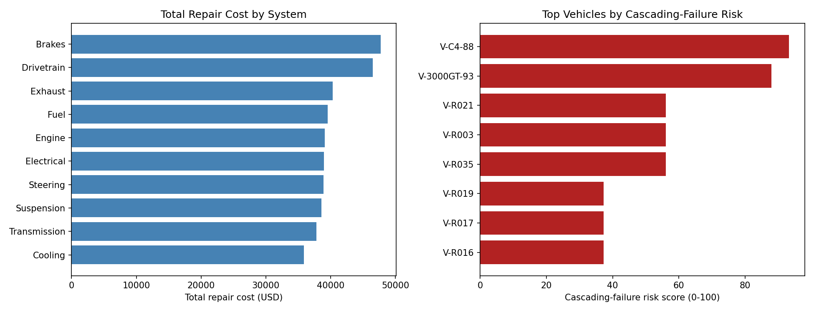

# Vehicle Repair & Cascading-Failure Analyzer

**[Try the live demo →](./demo/index.html)** (click any vehicle in the risk table to drill into its full repair timeline, no install needed.)



A SQL + pandas analysis tool over a shop repair-ticket database, built to
formalize the kind of pattern-recognition that comes from diagnosing real
cascading failures across interconnected vehicle systems by hand --
tracing how a worn suspension component leads to uneven tire wear and
brake vibration, or how a cooling system failure eventually takes out a
head gasket, rather than treating every repair ticket as an independent
event.

## What it does

- Stores repair history in a proper relational schema (SQLite:
  `vehicles` + `repair_tickets` tables) and queries it with real SQL
  (aggregation, grouping, parameterized queries) rather than just
  filtering a flat CSV.
- **`top_cost_systems()`** -- which vehicle systems are driving the most
  total repair spend and labor hours across a fleet.
- **`cascading_failure_candidates()`** -- flags vehicles where 3+
  *distinct* systems show up in repair tickets within a short mileage
  window (default 3,000 miles), which is a much stronger signal of an
  actual cascading root-cause failure than the same number of repairs
  spread across 100,000 miles of unrelated wear-and-tear.
- **`cascading_risk_score()`** -- a simple, transparent 0-100 heuristic
  combining how many systems clustered together with how many tickets
  were filed in that window, meant as a triage signal for "this vehicle
  is worth a deeper diagnostic look," not a certified prediction.

## Demo data

`generate_sample_data.py` builds a synthetic 42-vehicle shop database,
including two seeded "storyline" vehicles with realistic cascading-failure
patterns modeled loosely on real project-car rebuilds (a C4 Corvette and
a 3000GT VR-4) alongside 40 random background vehicles with independent,
unrelated repairs. **All data is fabricated for demonstration** -- no real
customer or shop data is included.

Running the analysis correctly picks the two storyline vehicles out as
the top 2 highest cascading-failure risk scores in the entire 42-vehicle
fleet, ahead of every randomly-generated vehicle:

```
=== Top 5 vehicles by cascading-failure risk score ===
 vehicle_id  distinct_systems_affected                          systems  risk_score
    V-C4-88                          5  Brakes, Engine, Fuel, Suspension...        93.3
V-3000GT-93                          4     Cooling, Engine, Exhaust, Susp...        88.0
     V-R021                          3     Drivetrain, Electrical, Trans...        56.0
```

## Usage

```bash
pip install -r requirements.txt

python generate_sample_data.py   # builds shop_repairs.db
python diagnostics.py            # runs the full analysis, prints results
python plot_diagnostics.py       # saves diagnostics_overview.png

python -m pytest tests/ -v
```

## Extending this

- Swap the heuristic risk score for a proper logistic regression /
  gradient-boosted model once enough labeled "confirmed cascading
  failure" outcomes exist to train on.
- Add odometer-rate normalization (miles/day) so mileage windows account
  for vehicles driven very differently.
- Connect to a real shop management system's export format (Mitchell1,
  Shopmonkey, etc.) instead of the synthetic generator.
